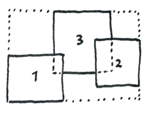
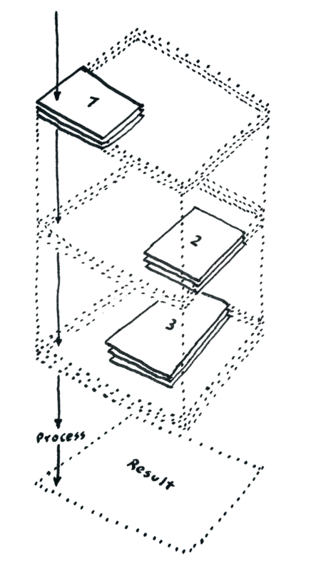
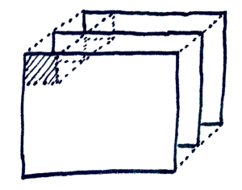

<p align="center">
  
</p>
<h1 align="center">StackComposed — QGIS Processing plugin</h1>

StackComposed computes a per-pixel statistic over a stack of georeferenced raster images, such as a Landsat time series. Input images can cover different scenes, tiles, or partially overlapping areas. StackComposed builds one wrapper extent that covers all inputs, reads each processing chunk from every image, masks nodata values as `NaN`, and writes the selected statistic to a GeoTIFF.

This is the QGIS Processing plugin version. It exposes the same core computation as the [standalone CLI version](https://github.com/SMByC/StackComposed) through a Processing algorithm, so it integrates with QGIS models, scripts, and batch processing.

Typical uses include computing median reflectance, counting valid observations, extracting the most recent valid pixel, returning the Julian day of a temporal statistic, or estimating a per-pixel linear trend from dated Landsat scenes.

## Core idea

For each output pixel, StackComposed builds a stack of values from all input images that overlap that pixel. The statistic is computed along the Z-axis only from valid values. Pixels outside an image footprint are treated as missing values.

The workflow is:

1. Read all input raster layers loaded in the QGIS project (the rasters are not loaded into memory at once).
2. Validate that all inputs share projection, pixel size, and pixel registration.
3. Build the wrapper extent that covers all images.
4. Split the wrapper into chunks.
5. Read only the current chunk from every input image.
6. Apply the optional preprocessing filter.
7. Compute the statistic along the Z-axis.
8. Stream chunk results to the output GeoTIFF.

### Wrapper extent

The wrapper extent is the minimum bounding extent that covers all input images. Output dimensions are derived from this extent and the input pixel size.



### Data cube by chunk

For each chunk, StackComposed reads the corresponding window from every image and arranges the values as a small data cube: rows, columns, and depth (Z-axis). The statistic is computed along the Z-axis for every pixel in that chunk.



### Parallel processing

StackComposed processes chunks in parallel using threaded Dask workers. The main thread is the only writer, which avoids concurrent writes to the output file. The **Number of processes** parameter controls how many worker threads are used; the default is the CPU count of the machine. The **Chunks size** parameter controls how much raster data each worker loads at once.



## Installation

The plugin is installed through the QGIS Plugin Manager. It bundles its own copies of Dask and supporting libraries, so no external Python dependencies are required beyond a standard QGIS 3.36+ installation.

### From the QGIS Plugin Manager

1. In QGIS, open **Plugins → Manage and Install Plugins**.
2. Search for **Stack Composed**.
3. Click **Install Plugin**.

### From a ZIP file

1. Download the plugin ZIP.
2. In QGIS, open **Plugins → Manage and Install Plugins → Install from ZIP**.
3. Select the ZIP file and install.

After installation, the algorithm appears in the Processing Toolbox under **Stack Composed → Assemble and reduce an image stack**.

## Input requirements

All input rasters must:

- use the same projection
- use the same pixel size
- be aligned to the same pixel grid
- have at least the requested band number

At least two images are required.

Inputs are selected as loaded raster layers in the QGIS project. The plugin accepts any raster format that QGIS can read through GDAL; the most common are `.tif`, `.img`, and `.hdr` (ENVI datasets).

## Using the algorithm

Open the Processing Toolbox, find **Stack Composed → Assemble and reduce an image stack**, and double-click to open the dialog. Configure the parameters and click **Run**.

The algorithm can also be used inside QGIS Processing models, called from the Python console, or executed in batch mode — like any other QGIS Processing algorithm.

## Parameters

| Parameter | Required | Default | Description |
|-----------|----------|---------|-------------|
| **Input rasters** | yes | - | Two or more raster layers loaded in the QGIS project. |
| **Statistic** | yes | Median | Statistic to compute. See [Statistics](#statistics). |
| **Band** | yes | `1` | Band number to process. Only one band per run. |
| **Nodata value** | no | file nodata | Input pixel value to treat as nodata. Overrides file metadata. Integer only. |
| **Output data type** | no | Default | Force output dtype or let StackComposed choose. See [Automatic output data types](#automatic-output-data-types). |
| **Number of processes** | no | CPU count | Number of parallel worker threads. Advanced parameter. |
| **Chunks size** | no | `500` | Chunk size in pixels. Larger chunks reduce overhead but use more memory. Advanced parameter. |
| **Preprocessing filter** | no | none | Filter applied to each pixel's stack of values before the statistic. See [Preprocessing](#preprocessing). |
| **Output raster** | yes | - | Destination for the result GeoTIFF, chosen through the QGIS output selector. |

## Output

The result is a single-band GeoTIFF covering the wrapper extent, with the same projection as the inputs and the pixel values set by the chosen statistic. The output file path is selected through the standard QGIS raster destination picker (temporary file, file on disk, or saved to a layer in the project).

## Statistics

| Statistic | Output meaning | Notes |
|-----------|----------------|-------|
| Median | Median of valid values | Ignores nodata/NaN. |
| Arithmetic mean | Arithmetic mean | Ignores nodata/NaN. |
| Geometric mean | Geometric mean | Uses positive values only. |
| Maximum value | Maximum valid value | Ignores nodata/NaN. |
| Minimum value | Minimum valid value | Ignores nodata/NaN. |
| Sum | Sum of valid values | Returns nodata/NaN when all observations are invalid. |
| Standard deviation | Standard deviation | Ignores nodata/NaN. |
| Number of valid pixels | Count of valid observations | Output dtype is `Byte` when fewer than 256 images, otherwise `UInt16`. |
| Last valid pixel | Pixel value from the most recent valid dated image | Requires [filename metadata](#filename-metadata). |
| Julian day of the last valid pixel | Julian day of the most recent valid dated image | Requires [filename metadata](#filename-metadata). |
| Julian day of the median value | Julian day of the temporal median position | Requires [filename metadata](#filename-metadata). |
| Linear trend | Ordinary least squares slope multiplied by 1e6 | Requires [filename metadata](#filename-metadata). Default output dtype is `Int32`. |

`Julian day of the last valid pixel` and `Julian day of the median value` write `0` where a pixel has no valid dated observation.

### Automatic output data types

When **Output data type** is set to **Default**, StackComposed selects an output data type from the statistic and inputs:

| Statistic group | Default dtype |
|-----------------|---------------|
| `Maximum value`, `Minimum value`, `Last valid pixel` | Input dtype |
| `Sum` | `Float64` if the input is `Float64`, otherwise `Float32` (avoids integer overflow) |
| `Julian day of the last valid pixel`, `Julian day of the median value` | `UInt16` |
| `Median`, `Arithmetic mean`, `Geometric mean`, `Standard deviation` | `Float64` if the input is `Float64`, otherwise `Float32` |
| `Number of valid pixels` | `Byte` for fewer than 256 images, otherwise `UInt16` |
| `Linear trend` | `Int32` |

The available explicit output data types are: `Default`, `Byte`, `UInt16`, `Int16`, `UInt32`, `Int32`, `Float32`, `Float64`.

## Preprocessing

Preprocessing is applied to each pixel's stack of values before the statistic. Values that fail the preprocessing condition become nodata/NaN for the statistic.

Enter the expression as a string in the **Preprocessing filter** parameter.

| Expression | Meaning | Example |
|------------|---------|---------|
| `>N`, `>=N`, `<N`, `<=N`, `==N`, `!=N` | Keep values matching a comparison | `>0` |
| `>A and <B` | Keep values matching both comparisons | `>=1 and <=5` |
| `percentile_LL_UL` | Keep values between per-pixel percentile bounds | `percentile_10_90` |
| `NN_std_devs` | Keep values within `NN` standard deviations of the per-pixel mean | `2.5_std_devs` |
| `NN_IQR` | Keep values within `NN` interquartile ranges of the per-pixel median | `1.5_IQR` |

Only `and` is supported for compound comparison expressions.

Practical preprocessing examples:

- Mask invalid reflectance values before computing a mean or median, for example `>0 and <=10000` for scaled optical reflectance products.
- Remove outliers along the stack before a summary statistic, for example `percentile_10_90` to keep the central 80% of each pixel's stack of values.
- Keep values near the local distribution along the stack before trend estimation, for example `2.5_std_devs` to reduce the effect of extreme cloud, shadow, or sensor artifacts.

## Chunk size and number of processes

The chunk size controls how much raster data each worker loads at once. For one chunk, memory is roughly proportional to:

```text
chunk_rows * chunk_cols * number_of_overlapping_images
```

General guidance:

- Increase **Chunks size** when processing overhead dominates and memory is available.
- Decrease **Chunks size** when memory pressure is high.
- Increase **Number of processes** only when enough memory exists for several chunks at once.
- Set **Number of processes** to `1` for debugging or for machines with limited memory.

The chunk size is clamped to the wrapper dimensions when the requested chunk is larger than the output raster.

## Filename metadata

The following statistics require date metadata parsed from filenames:

- Last valid pixel
- Julian day of the last valid pixel
- Julian day of the median value
- Linear trend

Supported Landsat filename styles include:

### Old Landsat IDs

```text
LC80070592016320LGN00_band1.tif
LE70070592003123LGN00_band1.tif
```

### New Landsat product IDs

```text
LC08_L1TP_007059_20161115_20170318_01_T2_b1.tif
LE07_L1TP_007059_20030503_20160928_01_T1_b1.tif
```

### SMByC Landsat filenames

```text
Landsat_8_53_020601_7ETM_Reflec_SR_Enmask.tif
Landsat_8_53_020823_7ETM_Reflec_SR_Enmask.tif
```

StackComposed extracts Landsat version, sensor, path, row, acquisition date, and Julian day from these patterns.

## About

StackComposed was designed and developed by the Forest and Carbon Monitoring System group (SMByC), operated by the Institute of Hydrology, Meteorology and Environmental Studies (IDEAM) — Colombia.

**Author and developer:** Xavier C. Llano <xavier.corredor.llano@gmail.com>  
**Theoretical support, testing and product verification:** SMByC-PDI group

## License

StackComposed is free/libre software, licensed under the GNU General Public License v3 (GPLv3).
